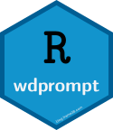

```{r knitr, echo = FALSE}
knitr::opts_chunk$set(
  collapse = TRUE,
  comment = "#>",
  fig.path = "README-"
)
```
```{r pkg_version, echo = FALSE}
version <- as.vector(read.dcf('DESCRIPTION')[, 'Version'])
version <- gsub('-', '.', version)
```
## wdprompt 
<!-- Incorrect alignment from  -->

[](https://www.tidyverse.org/lifecycle/#stable)
[](https://github.com/dgabbe/wdprompt/commits/master)
[](https://github.com/dgabbe/wdprompt/releases/Current)
<!-- [](https://github.com/dgabbe/wdprompt/tags) -->
<!-- travis badge -->
<!-- code coverage badge -->

Emulate bash prompt behavior in R console by replacing R's default prompt of `>` with the `getwd` string. RStudio does display the current working directory in the Console window title bar, but it is not normally where I look. The global environment can be cleared without affecting the prompt behavior.

Complete package documentation is [here](https://blog.frame38.com/wdprompt/reference/wdprompt-package.html).
